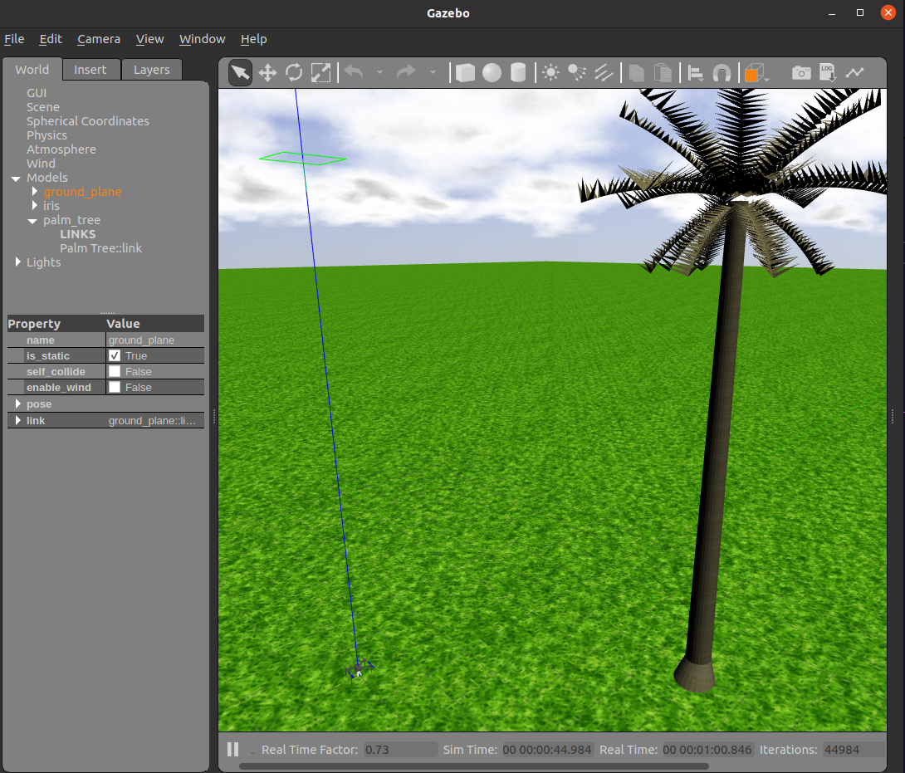

# Using Gazebo for Simulation

In Skyrats, we use Gazebo as our simulator. There, we can employ different plugins to simulate sensors, cameras, and effectively construct our competition scenarios, for example. We will use sky_sim repository for this tutorial. All of the .world files created should be in the worlds directory, same for the .launch files and models. Firstly, **follow the instructions in sky_ws**, to have all the required setup.

Link for the needed setup: 

## Directory Organization

Gazebo organizes its files into directories such as `launch`, `models`, and `worlds`. These directories play crucial roles in managing simulation environments and customizations. All of these directories are in our simulation submodule `sky_sim`.

### Launch Directory

The `launch` directory contains launch files (.launch) that specify how to start and configure Gazebo simulations, including which world file to use and any additional parameters.

### Models Directory

The `models` directory stores files describing objects, robots, or any other entities that can be placed in the simulation environment. These models are often reused across different simulations. You can add yout own models (done in Blender for example).

### Worlds Directory

The `worlds` directory holds world files (.world) that define the environment in which simulations take place. It includes terrain, objects, lighting, and other elements necessary for creating realistic scenarios.

## Creating Custom Launch Files

Custom launch files can be created to automate and configure Gazebo simulations according to specific requirements. These files specify which world to load, what models to include, and any additional parameters necessary for the simulation setup.

To do an example, here is a launch file from a world in sky_sim:

```launch
<launch>
  <!-- We resume the logic in empty_world.launch, changing only the name of the world to be launched -->
  <arg name="gui" default="true"/>
  <include file="$(find gazebo_ros)/launch/empty_world.launch">
    <arg name="world_name" value="$(find sky_sim)/worlds/my_world.world"/>
    <arg name="gui" value="$(arg gui)"/>
    <!-- more default parameters can be changed here -->
  </include>
</launch>
```
Here, we only launch our world, but usually we launch MAVROS node with our world, instead of running in two separate terminals the 
`apm.launch` and the `my_world.launch` files.

So let's include our mavros node:

```launch
<launch>
    <!-- vim: set ft=xml noet : -->
    <!-- base node launch file-->
    <arg name="fcu_url" default="udp://127.0.0.1:14550@"/>
    <arg name="gcs_url" default="" />
    <arg name="mavros_ns" default="/" />
    <arg name="tgt_system" default="1" />
    <arg name="tgt_component" default="1" />
    <arg name="pluginlists_yaml" value="$(find mavros)/launch/apm_pluginlists.yaml" />
    <arg name="config_yaml" default="$(find mavros)/launch/apm_config.yaml" />

    <arg name="log_output" default="screen" />
    <arg name="fcu_protocol" default="v2.0" />
    <arg name="respawn_mavros" default="false" />

    <node pkg="mavros" type="mavros_node" name="mavros" required="$(eval not respawn_mavros)" clear_params="true" output="$(arg log_output)" respawn="$(arg respawn_mavros)" ns="$(arg mavros_ns)">
        <param name="fcu_url" value="$(arg fcu_url)" />
        <param name="gcs_url" value="$(arg gcs_url)" />
        <param name="target_system_id" value="$(arg tgt_system)" />
        <param name="target_component_id" value="$(arg tgt_component)" />
        <param name="fcu_protocol" value="$(arg fcu_protocol)" />

        <!-- load blacklist, config -->
        <rosparam command="load" file="$(arg pluginlists_yaml)" />
        <rosparam command="load" file="$(arg config_yaml)" />
    </node>

    <!-- We resume the logic in empty_world.launch, changing only the name of the world to be launched -->
    <arg name="gui" default="true"/>
    <include file="$(find gazebo_ros)/launch/empty_world.launch">
        <arg name="world_name" value="$(find sky_sim)/worlds/sky_sim.world"/>
        <arg name="gui" value="$(arg gui)"/>
        <!-- more default parameters can be changed here -->
    </include>
</launch>
```
This is a standard launch file for our purposes here in Skyrats. Save this launch file as `my_world.launch`.

## SDF Files

SDF (Simulation Description Format) files are used to describe models, worlds, and other elements in Gazebo simulations. They contain XML-based markup specifying the properties, geometry, and behavior of entities within the simulation. Navigate through the SDF files in the Models directory to see examples.

## Modifying Worlds and Including Custom Models

Users can modify existing world files or create new ones to tailor the simulation environment to their specific needs. Custom models can be included by adding their descriptions to the world file and ensuring their corresponding files are present in the `models` directory.

For example, let's include a custom model called `palm_tree`:

```xml
<model name="palm_tree">
  <!-- Define the start of a new model with the name 'palm_tree' -->
  
  <include>
    <!-- Include another model from a URI -->
    
    <uri>model://palm_tree</uri>
    <!-- Specify the URI of the model to include -->
    <!-- In this case, it imports the 'palm_tree' model from the 'model://palm_tree' path -->
  </include>
  
  <pose>5 5 0 0 0 0</pose>
  <!-- Set the position and orientation of the model -->
  <!-- This places the model at coordinates (10, 10, 0) with no rotation -->
  
  <static>true</static>
  <!-- Specify that the model is static and won't move during simulation -->
  
  <turnGravityOff>true</turnGravityOff>
  <!-- Indicate that gravity effects are turned off for this model -->
</model>
```
Now if we run in a terminal `roslaunch sky_sim sky_sim.launch`, we will see our new world:

<figure><figcaption><p><em>Drone and our new palm tree from the gazebo_vegetation package</em></p></figcaption></figure>

## Using a Plugin in Gazebo

In this tutorial, we'll explore how to use a plugin in Gazebo simulation. We'll be using the ROS Gazebo Plugins. You can find more information about these plugins [here](https://classic.gazebosim.org/tutorials?tut=ros_gzplugins).

### Using the Bumper Plugin

First, let's assume we want to use the bumper plugin. You can find the relevant documentation for it [here](https://classic.gazebosim.org/tutorials?tut=ros_gzplugins#BumperPlugin).

### Modifying the Iris Base Copter Model

Assuming we're modifying the `iris_base` model, let's add collision and sensor elements, as well as the plugin configuration. Edit the `model.sdf` file from the `iris_base` directory in `models` directory :

```xml
<model name="iris_base">
  <!-- Other model elements -->

  <!-- Adding collision -->
  <collision name="drone_collision">
    <geometry>
      <box>
        <size>0.4 0.4 0.4</size> <!-- Specifies the size of the collision box -->
      </box>
    </geometry>
  </collision>

  <!-- Adding sensor -->

  <sensor name='my_contact' type='contact'> <!-- Defines a contact sensor -->
    <contact>
      <collision>drone_collision</collision> <!-- Specifies the collision the sensor is attached to -->
    </contact> 
    <plugin name="drone_gazebo_ros_bumper_controller" filename="libgazebo_ros_bumper.so"> <!-- Adds a plugin to the sensor -->
      <alwaysOn>true</alwaysOn> <!-- Specifies if the plugin is always active -->
      <updateRate>${update_rate}</updateRate> <!-- Specifies the update rate of the plugin -->
      <bumperTopicName>drone_bumper</bumperTopicName> <!-- Specifies the topic name for bumper data -->
      <frameName>world</frameName> <!-- Specifies the frame name for the plugin -->
    </plugin>
  </sensor>

</model>

```
Now, if we relaunch our simulation, we can monitor the ROS topic /drone_bumper using rostopic echo /drone_bumper and see if the drone touches any object. If you run the command while the drone is on the ground, you will see that the sensor detects the collision between the ground and the drone. When it takes off, there is no collision.

How about trying to collide with our palm tree? Try writing a Python code that moves the drone towards the tree using MAVROS.


